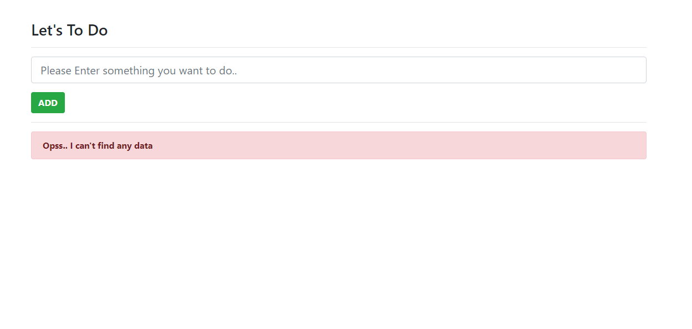
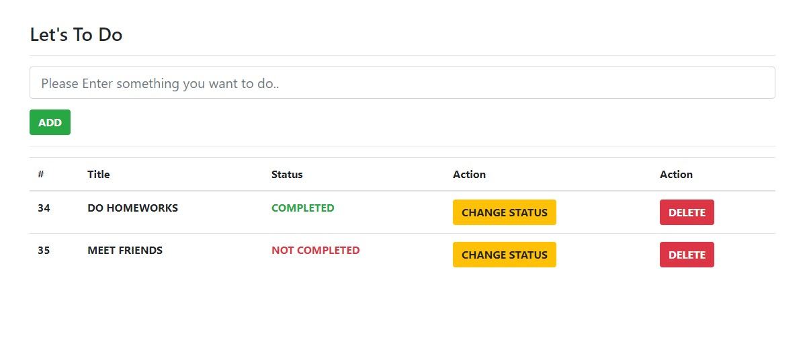

# TodoApp-Django

This project was generated with Django version 2.2.

## Development server

Run `python manage.py runserver` for a dev server. Navigate to `http://localhost:8000/`. The app will automatically reload if you change any of the source files.

## Some Screenshots from application

